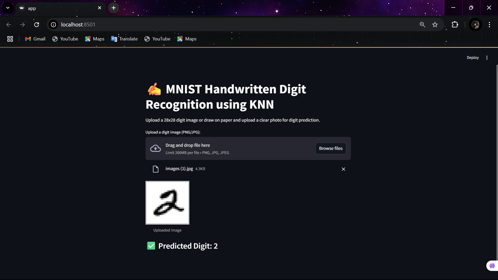

# ✍️ Handwritten Digit Recognition using KNN

An **end-to-end ML pipeline** to classify handwritten digits (0–9) using **scikit-learn pipelines** and **Streamlit for deployment**.

## 🚀 Project Overview

- Uses the **MNIST dataset** to train a **K-Nearest Neighbors (KNN) classifier**.
- Applies **clean image preprocessing**: grayscale, inversion, resizing, scaling.
- Builds a **scikit-learn pipeline** for consistent preprocessing and prediction.
- Hyperparameter tuning using **GridSearchCV** for best KNN parameters.
- Deploys using **Streamlit** for interactive digit prediction.

---

## 🛠️ Tech Stack

- **Python** (scikit-learn, numpy, Pillow)
- **Streamlit** (for deployment)
- **Jupyter Notebook** (for experimentation and pipeline building)

---
